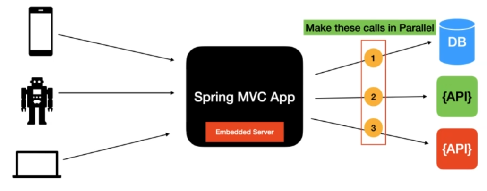
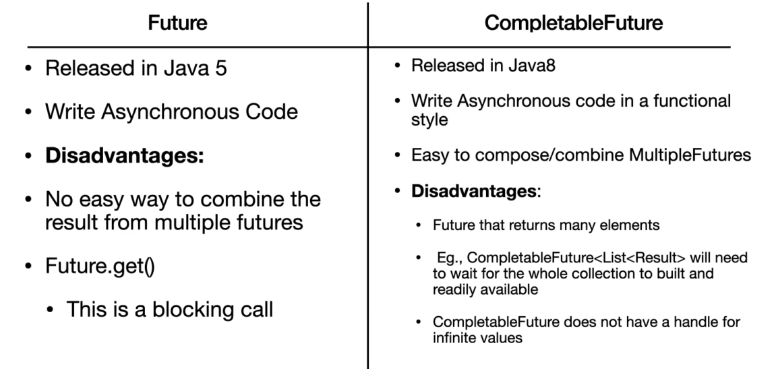
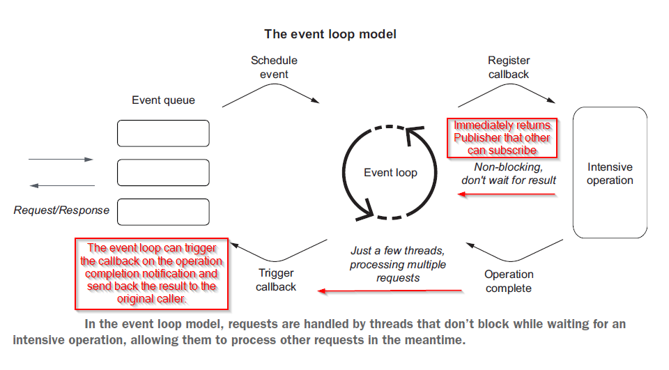
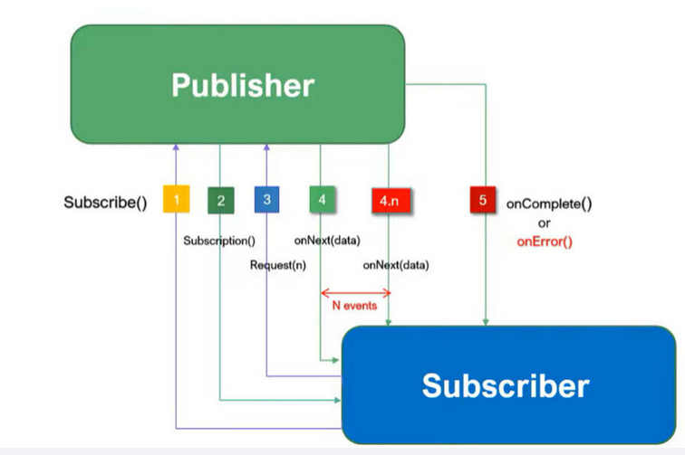

## Why we need Reactive Programming?

Reactive programming, particularly in the context of the Spring WebFlux framework, addresses the limitations of 
traditional synchronous, blocking I/O-based programming models. Here are some reasons why reactive programming is used 
and how it addresses these limitations:

#### Handling Non-Blocking I/O Operations: 
Traditional REST APIs in Spring MVC typically follow a blocking I/O model. When the server receives a request, it might 
block while waiting for a database query, file system read, or an external service call to complete.
Traditional Spring REST APIs built with Spring MVC use a thread-per-request model. Each incoming request ties up a 
thread until it completes, which can limit scalability in high-throughput scenarios. This can lead to resource wastage 
and potential bottlenecks under high load.

Reactive programming, on the other hand, allows the system to handle these operations asynchronously without blocking, 
which leads to better resource utilization and scalability.

#### Concurrency and Scalability: 
With blocking I/O, the number of simultaneous requests a server can handle is directly tied to the number of available 
threads. This can limit scalability and responsiveness, especially in situations with a large number of concurrent 
connections.

Reactive programming leverages non-blocking I/O to handle a large number of concurrent connections without needing to 
allocate a thread per connection. This can improve the system's ability to handle many simultaneous requests without a 
significant increase in resource usage.

#### Resilience and Responsiveness: 
Reactive systems can be more responsive and resilient to failures. By efficiently managing resources and handling I/O 
operations non-blockingly, the system can better cope with high loads and maintain responsiveness even under heavy 
traffic.

#### Back Pressure and Asynchronous Operations: 
Reactive programming models, which WebFlux supports, handle back pressure 
efficiently. When there's a slower downstream system or client, back pressure mechanisms help to regulate the flow of 
data, allowing systems to handle and process data more effectively.

#### Error Handling: 
Reactive programming models often offer more streamlined error handling through constructs like reactive 
streams, making it easier to propagate and manage errors in the asynchronous workflow.

## Limitations of embedded Tomcat with Spring ReST

Thread pool size for embedded tomcat in Spring MVC is 200. Although, we can increase the thread pool size based on the 
need but only to a certain limit. Let's say you want to support 10,000 concurrent users for your Spring ReST APIs but 
that doesn't mean you will create thread pool of size 10,000 threads. The reason is that thread is an expensive resource 
and can easily take up to 1 MB of heap space. So more threads means more memory consumption by thread itself. This 
leaves very less heap space for actually processing the request. This may cause an issue and impact overall performance 
of the system.

## Some improvements to overcome these limitations

We can make database calls or external APIs calls in parallel. For this, we have ``Callbacks`` 
and ``Futures``. 

### Callbacks
Callbacks are functions or code snippets that are passed as arguments to other functions, allowing those functions to 
execute the provided code once a specific operation completes. In Java, this is commonly achieved using interfaces or 
functional interfaces like ``java.util.function.Consumer`` or ``java.util.function.BiConsumer``. For instance, when an 
asynchronous operation (like a database call or API request) is initiated, a callback can be attached to handle the 
response or result once it's available.

However, the usage of callbacks comes with certain limitations:

#### Callback Hell/Nesting: 
Asynchronous operations might lead to nested callback functions, making the code harder to read and maintain (commonly 
known as "callback hell"). This happens when multiple asynchronous operations depend on the results of each other, 
leading to deeply nested and complex code structures.

#### Error Handling: 
Error handling in callback-based programming can become cumbersome. Asynchronous errors might not be straightforward to 
handle, leading to less readable and more error-prone code.

### Futures (or Promises in some contexts):
Futures (or Promises) represent a placeholder for a result that will be available at some point in the future. They 
provide a way to perform asynchronous operations and retrieve their results later. In Java, this is facilitated through 
classes like ``java.util.concurrent.Future`` or in modern Java versions, the ``java.util.concurrent.CompletableFuture``.

Limitations of Futures:

#### Limited Composition: 
Chaining asynchronous operations with Futures can be verbose and challenging. Handling scenarios where one operation 
depends on the result of another can lead to complex code, similar to callback nesting.

#### Blocking Waits: 
In some cases, calling ``get()`` on a Future to retrieve the result can block, leading to similar issues as with traditional 
blocking I/O.

While both callbacks and Futures were steps toward handling asynchronous programming in languages like Java, they have 
limitations in managing complex asynchronous workflows, error handling, and composing multiple asynchronous operations.

## Spring WebFlux

Spring WebFlux, as a reactive programming alternative in the Spring framework, addresses these limitations by allowing 
developers to build non-blocking, asynchronous, and event-driven applications. Spring WebFlux, provide a more 
comprehensive solution by using reactive streams, back pressure, and higher-order functions to address these limitations 
more effectively, offering better composition and error handling in asynchronous and non-blocking scenarios.

### Spring WebFlux Event Loop Model

The consumer can be notified whatever happened at the producer end based on how the consumer subscribes to the producer. 
So, if any such happens at the producer end, the producer will send an event and then consumer will fetch the data. That 
means the flow of data from application to client happens only when an event is published by a producer, which means the 
data flow is driven by an event.

Let's say that client subscribes to a database fetch event about any insert/update/delete operations on a DB table, so 
if any such operation occur at database end, the producer will publish an event, and since the client is a subscriber, 
it will stream the data.

Here we call producer as Publisher and Consumer as Subscriber.

### Backpressure on Data Streams

Sometimes the application may not be able to handle the response which contains the huge data, this eventually causes
the application to be crashed. In such cases, we can apply the backpressure on the flow of data which tells the publisher
to send the response in a serialized manner i.e., loads the data & sends with the response parts by parts. We can also
let the publisher to know how much data to be sent in the response at a time.

### Reactive Stream Specification
Reactive Streams in Spring WebFlux is an implementation of the Reactive Streams specification. It's a set of interfaces 
and protocols that enable the processing of asynchronous data streams with a focus on non-blocking, backpressure-aware 
processing.

#### Publisher Interface

~~~java
public interface Publisher<T> {
    void subscribe(Subscriber<? super T> var1);
}
~~~

#### Subscriber Interface

~~~java
public interface Subscriber<T> {
    void onSubscribe(Subscription var1);

    void onNext(T var1);

    void onError(Throwable var1);

    void onComplete();
}
~~~

#### Subscription Interface

~~~java
public interface Subscription {
    void request(long var1);

    void cancel();
}
~~~

#### Processor Interface

~~~java
public interface Processor<T, R> extends Subscriber<T>, Publisher<R> {
}
~~~

### Reactive Stream Workflow

**Step-1**: Subscriber will invoke subscribe(-) method of Publisher interface by passing the Subscriber instance as an input

**Step-2:** Publisher acknowledges the Subscriber about its subscription by calling onSubscribe(-) method of Subscriber 
interface. It's an internal call.

**Step-3:** Subscriber will invoke request(-) method of Subscription interface to fetch the data from publisher. It passes 
an input n, means no of data items which subscriber wants at a time from the publisher (backpressure)

**Step-4:** Publisher will send a stream of data to the subscriber by invoking onNext(-) method of Subscriber interface. As 
many data items are there, those many times the publisher will fire the onNext event.

**Step-5:** Once all the data items are received by the Subscriber, publisher will invoke onComplete(-) method of Subscriber 
interface to confirm that it is done with its job and the execution is successful. If there exists any error, publisher 
will invoke onError(-) method of Subscriber interface.

## Spring WebFlux ResponseEntity

WebFlux supports using a single value reactive type to produce the ResponseEntity asynchronously, and/or single and 
multi-value reactive types for the body. This allows a variety of async responses with ResponseEntity as follows:

**ResponseEntity<Mono<T>> or ResponseEntity<Flux<T>>** make the response status and headers known immediately while the 
body is provided asynchronously at a later point. Use Mono if the body consists of 0..1 values or Flux if it can 
produce multiple values.

**Mono<ResponseEntity<T>>** provides all three response status, headers, and body, asynchronously at a later 
point. This allows the response status and headers to vary depending on the outcome of asynchronous request handling.

**Mono<ResponseEntity<Mono<T>>> or Mono<ResponseEntity<Flux<T>>>** are yet another possible, albeit less common 
alternative. They provide the response status and headers asynchronously first and then the response body, also 
asynchronously, second.

## Functional Web Module in Spring WebFlux

Functional Web in the context of Spring WebFlux refers to a programming model offered by the Spring Framework that 
allows developers to build web applications using functional programming concepts. It's an alternative approach to the 
more traditional annotation-based programming model found in Spring MVC.

### Characteristics of Functional Web in Spring WebFlux:
**Functional Endpoints:** In the functional paradigm, endpoints are defined using functional constructs, such as 
RouterFunction and HandlerFunction, rather than using annotations like @Controller and @RequestMapping as in Spring MVC.

**RouterFunctions:** Routes are defined explicitly using RouterFunction, mapping HTTP requests to specific handlers. It 
allows for more explicit and programmatic definition of endpoints and request handling.

**HandlerFunctions:** Request handling logic is encapsulated within HandlerFunction instances, providing more control over 
how requests are processed and responses are generated.

**Reactive API Usage:** It seamlessly integrates with reactive programming constructs (Mono and Flux) provided by Reactor, 
enabling the handling of non-blocking, asynchronous requests in a functional style.

**Functional Programming Concepts:** It leverages functional programming concepts of immutability, composition, and 
high-order functions, providing a different way to define the web layer compared to the imperative style of Spring MVC.

### Benefits of Functional Web:
**Explicit Routing:** Developers have fine-grained control over route definitions and request handling.

**Testability:** Functional endpoints can be more straightforward to test as they often involve simple functions that can 
be unit-tested independently.

**Readability and Maintainability:** Functional style can sometimes lead to more concise, readable, and maintainable code, 
especially for complex routing scenarios.

#### Router Class
Please pay attention on the ``route().nest()`` function and inline response.
~~~java

import org.aks.spring.webflux.movie.review.handler.ReviewsHandler;
import org.springframework.context.annotation.Bean;
import org.springframework.context.annotation.Configuration;
import org.springframework.web.reactive.function.server.RouterFunction;
import org.springframework.web.reactive.function.server.ServerResponse;

import static org.springframework.web.reactive.function.server.RequestPredicates.path;
import static org.springframework.web.reactive.function.server.RouterFunctions.route;

@Configuration
public class ReviewRouter {

    @Bean
    public RouterFunction<ServerResponse> reviewsRoute(ReviewsHandler reviewsHandler) {
        return route()
                .nest(path("/v1/reviews"), builder ->
                        builder
                                .GET("", reviewsHandler::getReviews)
                                .POST("", reviewsHandler::addReview)
                                .PUT("/{id}", reviewsHandler::updateReview)
                                .DELETE("/{id}", reviewsHandler::deleteReview)
                                .GET("/stream", reviewsHandler::getReviewsStream))
                .GET("/v1/helloworld", (request -> ServerResponse.ok().bodyValue("HelloWorld")))
                .GET("/v1/greeting/{name}", (request -> ServerResponse.ok().bodyValue("hello " + request.pathVariable("name"))))
                .build();
    }
}
~~~

#### Handler Class

Please pay attention on -

1. How to get ``Review`` entity from ``ServerRequest`` - using ``request.bodyToMono(Review.class)``
2. When to use flatMap - 
   1. Want to convert ``Entity`` into ``Mono<Entity>`` or ``Flux<Entity>``. Here, Review to Mono<Review> because repository implementation returns Mono.
   2. Want to convert ``Mono<Entity> or Flux<Entity>`` to ``Mono<ServerResponse> or Flux<ServerResponse>``
~~~java
import org.springframework.web.reactive.function.server.ServerRequest;
import org.springframework.web.reactive.function.server.ServerResponse;
import reactor.core.publisher.Flux;
import reactor.core.publisher.Mono;

import org.aks.spring.webflux.movie.review.domain.Review;
import org.aks.spring.webflux.movie.review.repository.ReviewReactiveRepository;
import org.springframework.beans.factory.annotation.Autowired;
import org.springframework.http.HttpStatus;

@Component
public class ReviewHandler {

    private ReviewReactiveRepository reviewReactiveRepository;

    public ReviewHandler(ReviewReactiveRepository reviewReactiveRepository) {
        this.reviewReactiveRepository = reviewReactiveRepository;
    }

    public Mono<ServerResponse> addReview(ServerRequest request) {

        return request.bodyToMono(Review.class)
                .flatMap(reviewReactiveRepository::save)
                .flatMap(savedReview ->
                        ServerResponse.status(HttpStatus.CREATED)
                                .bodyValue(savedReview));

    }
}
~~~

#### Repository Interface

~~~java

import org.aks.spring.webflux.movie.review.domain.Review;
import org.springframework.data.mongodb.repository.ReactiveMongoRepository;
import reactor.core.publisher.Flux;

public interface ReviewReactiveRepository extends ReactiveMongoRepository<Review, String> {

    //Flux<Review> findReviewsByMovieInfoId(String reviewId);

    Flux<Review> findReviewsByMovieInfoId(Long movieInfoId);
}

public interface ReactiveCrudRepository<T, ID> extends Repository<T, ID> {

    <S extends T> Mono<S> save(S entity);
    
	----
	----
}
~~~

#### Validator Class

~~~java
import lombok.extern.slf4j.Slf4j;
import org.aks.spring.webflux.movie.review.domain.Review;
import org.springframework.stereotype.Component;
import org.springframework.validation.Errors;
import org.springframework.validation.ValidationUtils;
import org.springframework.validation.Validator;

@Component
@Slf4j
public class ReviewValidator implements Validator {
    @Override
    public boolean supports(Class<?> clazz) {
        return Review.class.equals(clazz);
    }

    @Override
    public void validate(Object target, Errors errors) {
        ValidationUtils.rejectIfEmpty(errors,"movieInfoId", "movieInfoId.null", "Pass a valid movieInfoId" );
        ValidationUtils.rejectIfEmpty(errors,"rating", "rating.null", "Pass a valid rating" );
        Review review = (Review) target;
        log.info("Review : {}" , review);
        if(review.getRating()!=null && review.getRating()<0.0){
            errors.rejectValue("rating", "rating.negative", "rating is negative and please pass a non-negative value");
        }

    }
}
~~~

#### Global Exception Handler Class

~~~java
import lombok.extern.slf4j.Slf4j;
import org.aks.spring.webflux.movie.review.exception.ReviewDataException;
import org.aks.spring.webflux.movie.review.exception.ReviewNotFoundException;
import org.springframework.boot.web.reactive.error.ErrorWebExceptionHandler;
import org.springframework.core.io.buffer.DataBufferFactory;
import org.springframework.http.HttpStatus;
import org.springframework.stereotype.Component;
import org.springframework.web.server.ServerWebExchange;
import reactor.core.publisher.Mono;

@Slf4j
@Component
public class GlobalErrorHandler implements ErrorWebExceptionHandler {
    @Override
    public Mono<Void> handle(ServerWebExchange exchange, Throwable ex) {
        log.error("Exception Message is : {} ", ex.getMessage(), ex);

        DataBufferFactory bufferFactory = exchange.getResponse().bufferFactory();
        var errorMessage = bufferFactory.wrap(ex.getMessage().getBytes());
        if(ex instanceof ReviewNotFoundException){
            exchange.getResponse().setStatusCode(HttpStatus.NOT_FOUND);
            return exchange.getResponse().writeWith(Mono.just(errorMessage));
        }

        if(ex instanceof ReviewDataException){
            exchange.getResponse().setStatusCode(HttpStatus.BAD_REQUEST);
            return exchange.getResponse().writeWith(Mono.just(errorMessage));
        }

        exchange.getResponse().setStatusCode(HttpStatus.INTERNAL_SERVER_ERROR);
        return exchange.getResponse().writeWith(Mono.just(errorMessage));
    }
}
~~~

## Spring WebClient

Spring WebClient is a non-blocking, reactive, and asynchronous HTTP client provided by the Spring Framework. It is a 
part of the Spring WebFlux module and offers a modern, functional API for making HTTP requests. It's specifically 
designed for use in reactive, non-blocking applications, making it an ideal choice for Spring WebFlux applications.

### Key Features of Spring WebClient:
**Reactive and Non-Blocking:** As part of the WebFlux module, WebClient is built to perform non-blocking, 
asynchronous operations. It's designed to work efficiently within the reactive programming paradigm, handling HTTP 
requests asynchronously without blocking threads.

**Functional API:** It provides a fluent and functional API for building and executing HTTP requests. This functional 
style enables composing, filtering, and modifying requests and responses through a series of operations.

**Support for Reactive Streams:** It can handle the response as reactive types such as Mono and Flux, making it 
well-suited for integrating with other reactive components in a Spring WebFlux application.

**Customization and Configuration:** WebClient allows customization of request parameters, headers, cookies, and allows 
the configuration of various properties related to the HTTP client.

WebClient needs an HTTP client library to perform requests with. There is built-in support for the following:

    Reactor Netty

    JDK HttpClient

    Jetty Reactive HttpClient

    Apache HttpComponents

    Others can be plugged via ClientHttpConnector.

### Configuration

The simplest way to create a WebClient is through one of the static factory methods:

    WebClient.create()

    WebClient.create(String baseUrl)

You can also use WebClient.builder().

~~~java
import org.springframework.context.annotation.Bean;
import org.springframework.context.annotation.Configuration;
import org.springframework.web.reactive.function.client.WebClient;

@Configuration
public class WebClientConfig {

    @Bean
    public WebClient webClient(WebClient.Builder builder) {
        return builder.build();
    }
}
~~~

### retrieve() method - Getting output from APIs calls

#### How to extract the response
~~~java
WebClient client = WebClient.create("https://example.org");

Mono<ResponseEntity<Person>> result = client.get()
		.uri("/persons/{id}", id).accept(MediaType.APPLICATION_JSON)
		.retrieve()
		.toEntity(Person.class);
~~~

#### Get only the body
~~~java
WebClient client = WebClient.create("https://example.org");

Mono<Person> result = client.get()
		.uri("/persons/{id}", id).accept(MediaType.APPLICATION_JSON)
		.retrieve()
		.bodyToMono(Person.class);
~~~

#### Get a stream of decoded objects
~~~java
Flux<Quote> result = client.get()
		.uri("/quotes").accept(MediaType.TEXT_EVENT_STREAM)
		.retrieve()
		.bodyToFlux(Quote.class);
~~~

#### Response with status
By default, 4xx or 5xx responses result in an WebClientResponseException, including sub-classes for specific HTTP 
status codes. To customize the handling of error responses, use onStatus handlers as follows:
~~~java
Mono<Person> result = client.get()
		.uri("/persons/{id}", id).accept(MediaType.APPLICATION_JSON)
		.retrieve()
		.onStatus(HttpStatus::is4xxClientError, response -> ...)
		.onStatus(HttpStatus::is5xxServerError, response -> ...)
		.bodyToMono(Person.class);
~~~
See ``org.aks.spring.webflux.movies.client.MoviesInfoRestClient.retrieveMovieInfo`` for more details.

### Exchange

The exchangeToMono() and exchangeToFlux() methods are useful for more advanced cases that require more control, 
such as to decode the response differently depending on the response status:
~~~java
Mono<Person> entityMono = client.get()
		.uri("/persons/1")
		.accept(MediaType.APPLICATION_JSON)
		.exchangeToMono(response -> {
			if (response.statusCode().equals(HttpStatus.OK)) {
				return response.bodyToMono(Person.class);
			}
			else {
				// Turn to error
				return response.createError();
			}
		});
~~~

For exchange implementation - ``org.aks.spring.webflux.movies.client.MoviesInfoRestClient.retrieveMovieInfo_exchange``

### Retry
You can specify the number of retry.
~~~java
.retry(3)
~~~
Another way is to create a retry with ``maxAtttempts`` for specific exception with backoff interval before retry attempt.
**This one is the preferred way of implementing Retry**.
~~~java
import org.aks.spring.webflux.movies.exception.MoviesInfoServerException;
import org.aks.spring.webflux.movies.exception.ReviewsServerException;
import reactor.core.Exceptions;
import reactor.util.retry.Retry;
import reactor.util.retry.RetrySpec;

import java.time.Duration;

public class RetryUtil {

    public static Retry retrySpec() {
        return RetrySpec.fixedDelay(3, Duration.ofSeconds(1))
                .filter((ex) -> ex instanceof MoviesInfoServerException || ex instanceof ReviewsServerException)
                .onRetryExhaustedThrow(((retryBackoffSpec, retrySignal) -> Exceptions.propagate(retrySignal.failure())));

    }
}
~~~
and then chain the retrySpec() call with client.
~~~java
.retryWhen(RetryUtil.retrySpec())
~~~
See ``org.aks.spring.webflux.movies.client.MoviesInfoRestClient.retrieveMovieInfo`` for more details.

## Server Sent Events (SSE)
Server-Sent Events (SSE) is a web technology that enables servers to push data to the client over a single, long-lived 
HTTP connection. It's an excellent choice for applications that require real-time data updates or event-driven 
communication from the server to the client.

In Spring WebFlux, you can implement Server-Sent Events using the ``Sinks`` utility, which provides a simple and efficient 
way to generate and handle asynchronous data streams.

How to create a sink
~~~java
Sinks.Many<MovieInfo> movieInfoSink = Sinks.many().replay().latest();
~~~

Sink as publisher using ``tryEmitNext(T)`` method
~~~java
@PostMapping("/movieinfos")
@ResponseStatus(HttpStatus.CREATED)
public Mono<MovieInfo> addMovieInfo(@RequestBody @Valid MovieInfo movieInfo) {
        return moviesInfoService.addMovieInfo(movieInfo)
        .doOnNext(savedMovieInfo -> movieInfoSink.tryEmitNext(savedMovieInfo));

        }
~~~

Sink as subscriber using ``asFlux()`` method
~~~java
@GetMapping(value = "/movieinfos/stream", produces = MediaType.APPLICATION_NDJSON_VALUE)
    public Flux<MovieInfo> streamMovieInfos() {

        return movieInfoSink.asFlux();
    }
~~~

Sink inside handler class
~~~java
Sinks.Many<Review> reviewsSink = Sinks.many().replay().latest();
~~~

~~~java
public Mono<ServerResponse> addReview(ServerRequest serverRequest) {

        return serverRequest.bodyToMono(Review.class)
                .doOnNext(this::validate)
                .flatMap(review -> reviewReactiveRepository.save(review))
                .doOnNext(review -> {
                    reviewsSink.tryEmitNext(review);
                })
                .flatMap(savedReview ->
                        ServerResponse.status(HttpStatus.CREATED)
                                .bodyValue(savedReview));
    }
~~~

~~~java
public Mono<ServerResponse> getReviewsStream(ServerRequest serverRequest) {
        return ServerResponse.ok()
                .contentType(MediaType.APPLICATION_NDJSON)
                .body(reviewsSink.asFlux(), Review.class)
                .log();
    }
~~~

